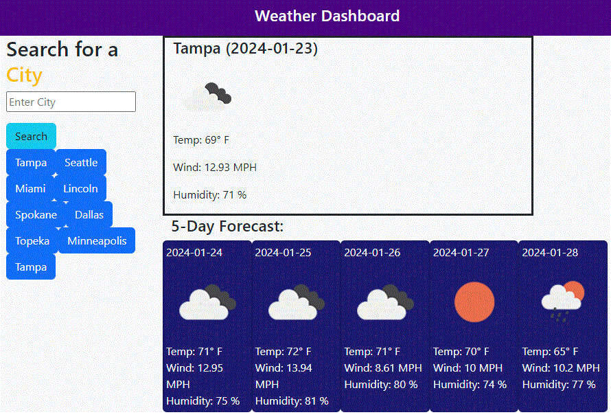

# Weather App
Module 6 Challenge

## Description

Site provides weather information for an entered city.
User enters a city name in the 

## Installation

Contains\
  index.html\
  stylesheet style.css under directory assets/css\
  javascript script.js under directory assets/js\
  one image file under directory assets/images which is not used within the website\

## Screenshot

## Deployed at https://petemaynard.github.io/Quiz_Game/

## Repository at https://github.com/petemaynard/Password_Generator/Quiz_Game

## Credits

Created by Pete Maynard
with some assistance from tutor Dru Sanchez

